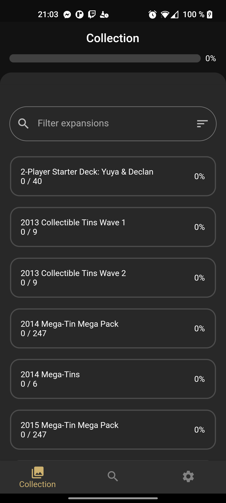
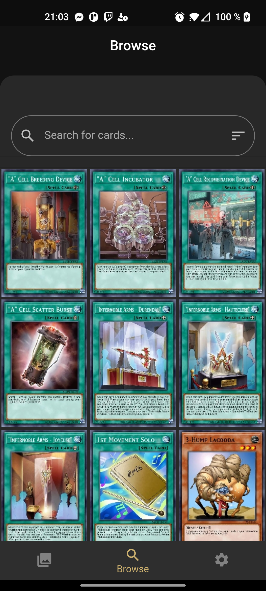
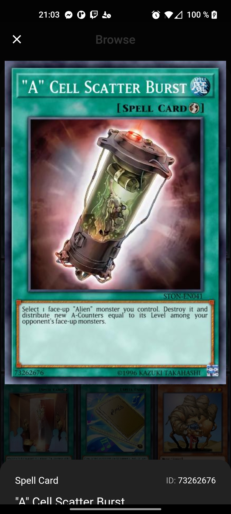
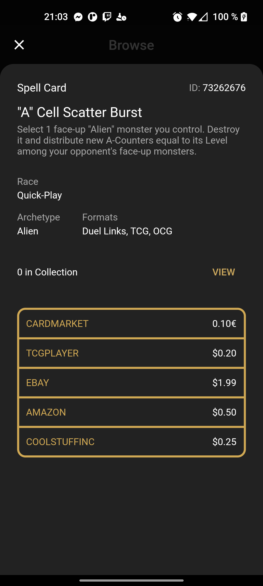
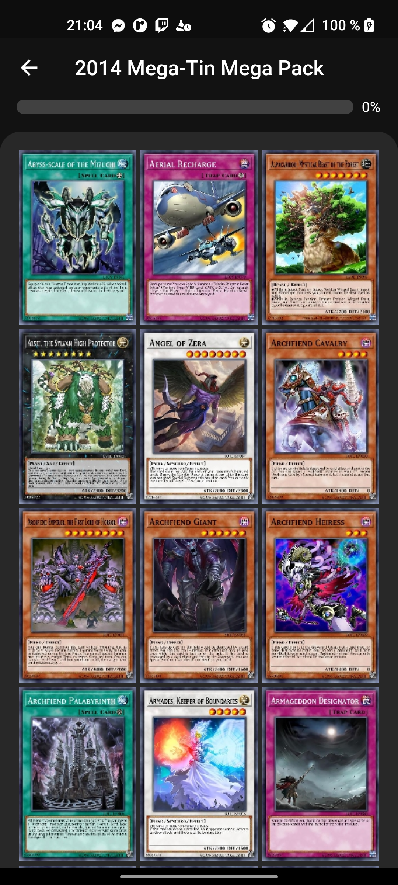
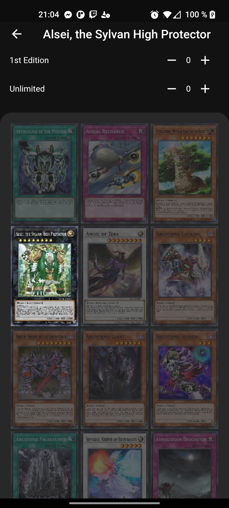

# ygo_collection_manager

[](https://github.com/TesteurManiak/ygo_collection_manager/actions/workflows/flutter.yml)
[](https://coveralls.io/github/TesteurManiak/ygo_collection_manager?branch=main)

## Getting Started

* To generate or re-generate the database adapters or the mock files use:

```bash
flutter packages pub run build_runner build
```

* To generate or re-generate the golden files use:

```bash
flutter test --update-goldens --tags=golden
```

## Features

* Add card to collection
* Search through all released card sets
* Check your completion rate
* View card details
* Dark & Light themes
* Use of Navigator 2.0
* Hosted with Github Pages

## TODO

* Write tests (ongoing)
* Dedicated Web layout
* Add filters for expansions
* Add filters for cards
* Release on the Play Store

## Screenshots

<p float="left">






</p>

## Dependencies

### Database

* [hive](https://pub.dev/packages/hive)
* [hive_flutter](https://pub.dev/packages/hive_flutter)
* [hive_generator](https://pub.dev/packages/hive_generator)

### Dependency Injection

* [get_it](https://pub.dev/packages/get_it)

### State Management

* [rxdart](https://pub.dev/packages/rxdart) (Might migrate to [flutter_bloc](https://pub.dev/packages/flutter_bloc))

### Navigation

* [go_router](https://pub.dev/packages/go_router)

### Tests

* [golden_toolkit](https://pub.dev/packages/golden_toolkit)
* [mockito](https://pub.dev/packages/mockito)
* [device_sizes](https://github.com/matthew-carroll/device_sizes.git)

### Others

* [cached_network_image](https://pub.dev/packages/cached_network_image)
* [connectivity_plus](https://pub.dev/packages/connectivity_plus)
* [dio](https://pub.dev/packages/dio)
* [equatable](https://pub.dev/packages/equatable)
* [snapping_sheet](https://pub.dev/packages/snapping_sheet)
